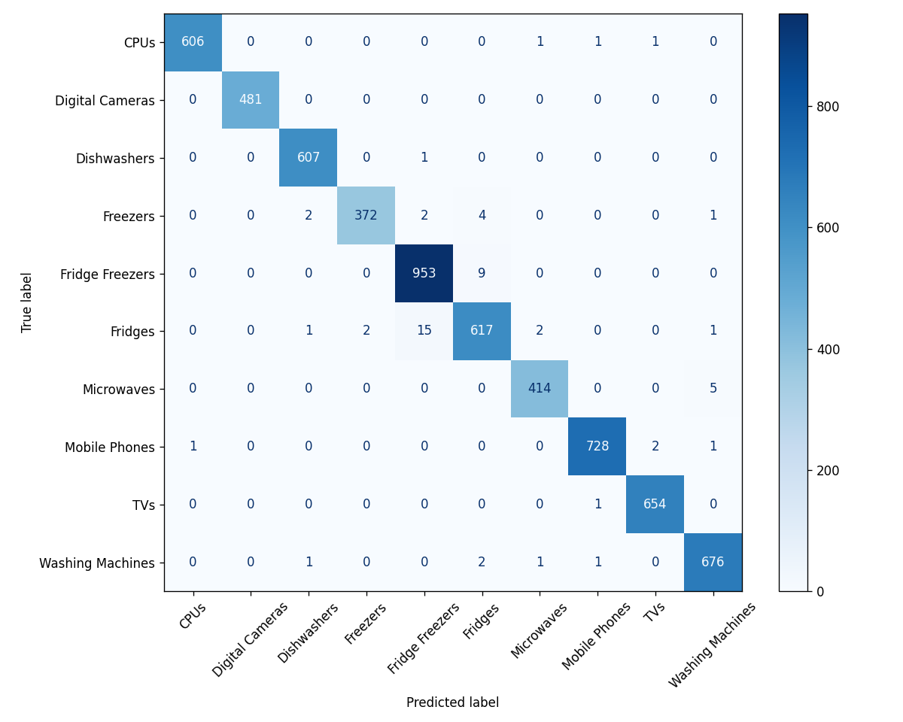

# Product Category Classifier

Model masinskog ucenja koji na osnovu **naziva proizvoda** automatski predlaze **kategoriju** (npr. `kenwood k20mss15 solo` -> `Microwaves`).

## Struktura projekta
```
data/products.csv                       # skup podataka (35k+ proizvoda)
notebooks/product_classification.ipynb  # analiza, feature engineering, poredjenje modela, evaluacija
common.py                               # ucitavanje i ciscenje podataka
train_model.py                          # treniranje i cuvanje modela
predict_category.py                     # interaktivno testiranje
models/model.pkl                        # istrenirani model
reports/                                # matrica zabune i klasifikacioni izvjestaj
requirements.txt
```

## Pokretanje
```bash
git clone https://github.com/nelaITA/product-category-classifier.git
cd product-category-classifier
pip install -r requirements.txt

python train_model.py        # (opciono) ponovo trenira model i cuva ga u models/model.pkl
python predict_category.py   # interaktivno testiranje
```
Primjer:
```
Naziv proizvoda: bosch wap28390gb 8kg 1400 spin
Predvidjena kategorija: Washing Machines
```
Izlaz iz programa: `exit` ili `q`.

## Podaci i ciscenje
- Nazivi kolona su imali razmake i `_`, pa su ocischeni.
- Uklonjeni redovi bez naslova ili kategorije.
- Ujednacene oznake kategorija: `fridge` -> `Fridges`, `CPU` -> `CPUs`, `Mobile Phone` -> `Mobile Phones`.
- Naslovi prebaceni u mala slova, uklonjeni duplikati.
- Nakon ciscenja: ~30.800 proizvoda, 10 kategorija.
- Koristi se samo `Product Title`; ostale kolone (Merchant ID, pregledi, ocjena, datum) nisu povezane sa kategorijom.

## Model
TF-IDF (rijeci 1-2 grama + karakteri 2-5 grama) -> **LinearSVC** (`class_weight="balanced"`).

Poredjeni su MultinomialNB, LogisticRegression, RandomForest i LinearSVC (detalji u notebooku).
Meta karakteristike (broj rijeci, karaktera, cifre, najduza rijec, specijalni znaci) nisu znacajno poboljsale rezultat (99.08% vs 99.06%), pa nisu ukljucene.

## Rezultati (20% test skup)
- **Accuracy: 99.06%**
- Najvise gresaka: `Fridges` / `Fridge Freezers` / `Freezers` (slicni proizvodi).
- Detaljan izvjestaj: `reports/classification_report.txt`, matrica zabune: `reports/confusion_matrix.png`.



## Poznata ogranicenja
- Kratki nazivi koji sadrze samo oznaku modela (npr. `smeg sbs8004po`) mogu biti nepouzdani.
- Model nije vidio nove brendove/modele van skupa za treniranje; za nove kategorije potrebno je ponovno treniranje.

## Testni primjeri iz zadatka
| Naziv | Ocekivano |
|---|---|
| iphone 7 32gb gold | Mobile Phones |
| olympus e m10 mark iii geh use silber | Digital Cameras |
| kenwood k20mss15 solo | Microwaves |
| bosch wap28390gb 8kg 1400 spin | Washing Machines |
| bosch serie 4 kgv39vl31g | Fridge Freezers |
| smeg sbs8004po | Fridge Freezers |
